## Ideas
Start screen by having the viewbox a different location. \
The grid array contains 2 bits, where 00 is empty and then 01 can be the color red. \
Make a better sprite for number 1. \
When clearing lines, make the camera shake a little by changing the viewbox.
## Tile numbers
## Tile 0
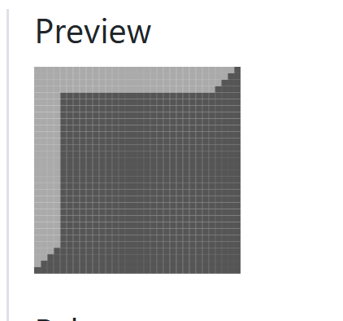
## Tile 1
number A?
## Tile 2

## Tile 3
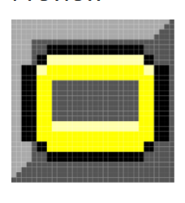
## Tile 4

## Tile 5
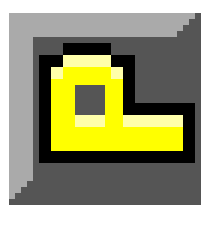
## Tile 6
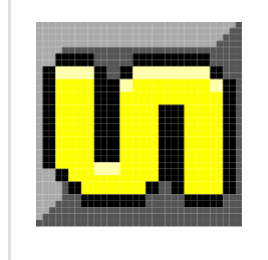
## Tile 7
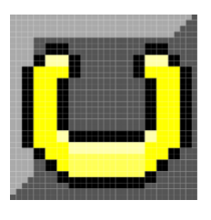
## Tile 8
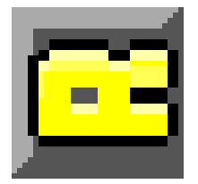
## Tile 9

## Tile 10

## Tile 11
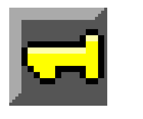'
## Tile 12

## Tile 13
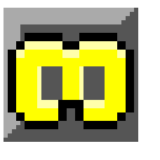
## Tile 14
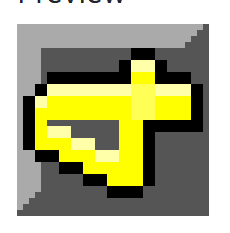
## Tile 15

## Tile 16
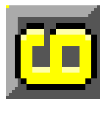
## Tile 17
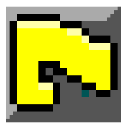
## Tile 18
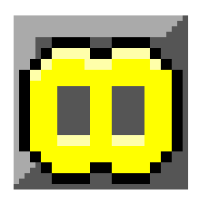
## Tile 19
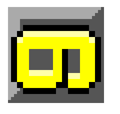
## Tile 20
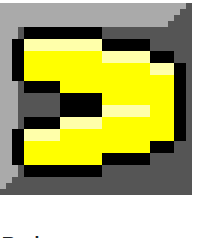
## Tile 21
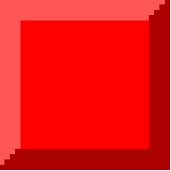
## Tile 22
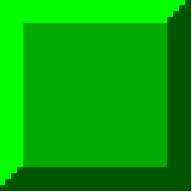
## Tile 23

## Tile 24 and sprite 12-15

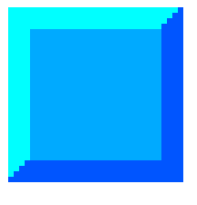
## Tile 25 and sprite 16-19

## Tile 26 and spirte 20-23
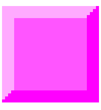
## Tile 27 sprite 24-27
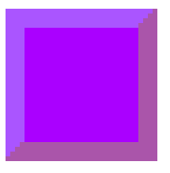
## Tile 29
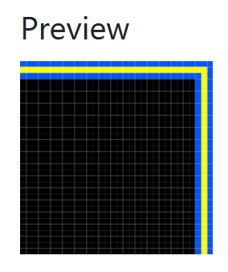
## Tile 30
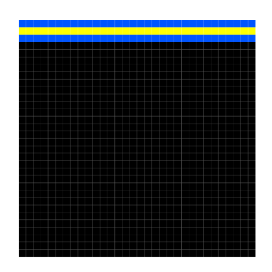
## Tile 31
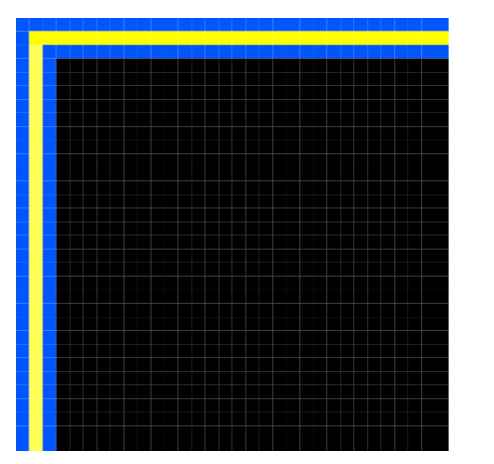