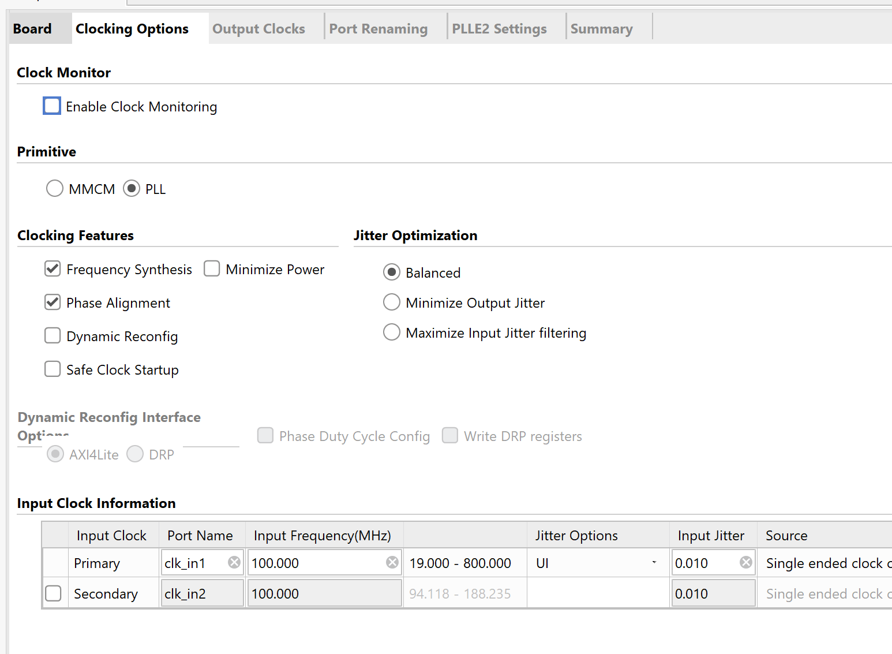
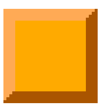
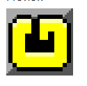

## SetUp
After running sbt build (since Top.v is in the gitIgnore file) in the cmd and adding the all the verilog files to a vivado projects with the correct restraints files for your own board, you will have to go into clock wizard by opening the IP catalog in vivado under project manager. In IP catalog search for clock wizard and select the PLL option in the clocking options tab.

Give the output of the PLL clock a frequency of 50 mhz, and select the following options:

Know the PLL should be ready to be generated. Your design hierarchy, after adding the Pll.v file to design resources, should look like this:

## Game Tutorial
When starting the game, you will see the start screen. Here the start button is the central button on the basys board. This button is the same button used on the game over screen to play again. When the tetris game is running, a piece will be generated pseudo randomly, that the player can move horizontally by pressing the buttons on either side depending on which way the player wants to move the piece.  The piece controlled by the player can be rotated by pressing the button up, and the player can also increase the piece falling speed by pressing the button down.
Clearing more lines at once will give a better score, just note that the score is displayed in hexadecimal, but the level displayed is decimal. When the level increases, so will the fall speed when and when not pressing the down button.
When a piece is placed out of bounds the game will end, and the score and level will be reset.
For testing purposes the level is incremented every 5 lines cleared, were its 10 in the original tetris.
This can be changed in line 154 in the ScoreDecoder module. 
## For refernce only (not actual point system)
 

## Tile numbers
## Tile 0

## Tile 1

## Tile 2

## Tile 3

## Tile 4

## Tile 5

## Tile 6

## Tile 7

## Tile 8

## Tile 9

## Tile 10

## Tile 11
'
## Tile 12

## Tile 13

## Tile 14

## Tile 15

## Tile 16

## Tile 17

## Tile 18

## Tile 19

## Tile 20

## Tile 21

## Tile 22

## Tile 23

## Tile 24 and sprite 12-15

## Tile 25 and sprite 16-19

## Tile 26 and spirte 20-23

## Tile 27 sprite 24-27

## Tile 28

## Tile 29

## Tile 30

## Tile 31

## Tile 32

## Tile 33
