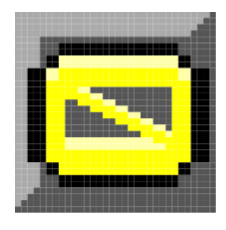

## Ideas
Start screen by having the viewbox a different location. \
The grid array contains 2 bits, where 00 is empty and then 01 can be the color red. \
Make a better sprite for number 1. \
## Tile numbers
## Tile 0

## Tile 1
number A?
## Tile 2
## Tile 3
O
## Tile 4

## Tile 10

## Tile 11

## Tile 29

## Tile 30

## Tile 31
